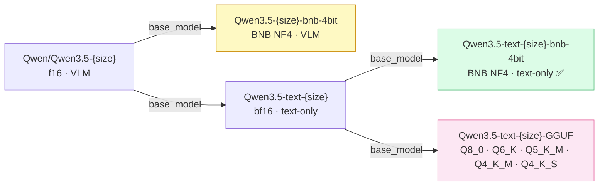

# qwen35-toolkit

Qwen3.5 models ship as full-precision VLMs — too large for most consumer GPUs
out of the box. This toolkit prepares them for text-only LoRA fine-tuning and
inference on limited hardware: correct BNB quantization, clean visual tower
strip, and inference verification before publishing.

What it does:
- Quantize f16 → BNB NF4 4-bit (fits a 4B model in ~5 GB VRAM)
- Strip the visual tower — saves ~0.2–0.9 GB and produces a clean text-only
  model; VLM fine-tuning is not the goal here
- Verify quantization quality and inference correctness before publishing
- Sync models to HuggingFace Hub with SHA256-level diff checking

If you have a mid-range GPU and want to fine-tune Qwen3.5 on your own data,
this pipeline aims to make that feasible once the documented hardware
requirements are met.

Part of a two-repo ecosystem:

| Repo | Purpose |
|------|---------|
| **qwen35-toolkit** (this repo) | Model prep — BNB quantization, visual tower strip, verify, upload |
| [qwen-qlora-train](https://github.com/techwithsergiu/qwen-qlora-train) | LoRA training, adapter inference, CPU merge |

---

## Setup

### Prerequisites

- Arch Linux (or any Linux with NVIDIA driver)
- Python 3.11
- CUDA via driver (`nvidia-smi` works → CUDA is fine)

```bash
# I'm using Arch btw
yay -S python311
python3.11 -m venv venv
source venv/bin/activate
```

### Install

```bash
# 1. PyTorch with CUDA (must be installed before this package)
pip install torch torchvision --index-url https://download.pytorch.org/whl/cu124

# 2a. Editable install (local clone)
pip install -e .

# 2b. Install directly from GitHub
pip install git+https://github.com/techwithsergiu/qwen35-toolkit.git
```

> For LoRA fine-tuning of prepared models, see
> [qwen-qlora-train](https://github.com/techwithsergiu/qwen-qlora-train).

### Authentication

`huggingface_hub` is installed automatically with this package. Run once before using any command:

```bash
hf auth login
```

Alternatively, pass `--hf-token hf_...` per command or set `HF_TOKEN` as an environment variable.

---

## Quick usage

> **Start with 0.8B** to validate the pipeline on your hardware before moving to larger models.
> The source model `unsloth/Qwen3.5-0.8B` is a community-maintained fp16 mirror of
> `Qwen/Qwen3.5-0.8B` on HuggingFace Hub.

```bash
# 1. Quantize to BNB 4-bit
qwen35-convert --model unsloth/Qwen3.5-0.8B --output ./Qwen3.5-0.8B-bnb-4bit

# 2. Strip visual tower → text-only
qwen35-strip --model ./Qwen3.5-0.8B-bnb-4bit --output ./Qwen3.5-text-0.8B-bnb-4bit

# 3. Verify
qwen35-verify-qwen35 --model ./Qwen3.5-0.8B-bnb-4bit
qwen35-verify        --model ./Qwen3.5-text-0.8B-bnb-4bit

# 4. Upload
qwen35-upload --local ./Qwen3.5-text-0.8B-bnb-4bit --repo <your-hf-username>/Qwen3.5-text-0.8B-bnb-4bit
```

---

## Published Models

This toolkit was validated end-to-end by producing and publishing 16 models
across 4 collections — all on an RTX 3070 with 7.7 GB VRAM.

See [docs/models.md](docs/models.md) for the full list and HuggingFace README templates.

Four model families produced from the original Qwen3.5 f16:



---

## Documentation

Full docs available at **[techwithsergiu.github.io/qwen35-toolkit](https://techwithsergiu.github.io/qwen35-toolkit/)**.

| Doc | Contents |
|-----|----------|
| [docs/setup.md](docs/setup.md) | Prerequisites, install, HuggingFace authentication |
| [docs/quickstart.md](docs/quickstart.md) | Full pipeline walkthrough — both paths (BNB + GGUF), all steps |
| [docs/commands.md](docs/commands.md) | All CLI commands with module paths and flags |
| [docs/conversion-pipeline.md](docs/conversion-pipeline.md) | Full pipeline diagram — both paths, commands per step |
| [docs/convert.md](docs/convert.md) | BNB quantization strategy, skip modules, `--low-vram`, `--verbose` |
| [docs/strip.md](docs/strip.md) | Visual tower stripping, dropped prefixes, config rebuild, chat template patch |
| [docs/verify.md](docs/verify.md) | Verification steps, device strategy, image test, function tree |
| [docs/upload.md](docs/upload.md) | Six sync modes, SHA256/LFS behaviour, push/pull output format |
| [docs/gguf.md](docs/gguf.md) | llama.cpp setup, HF→GGUF conversion, quantization types |
| [docs/tools.md](docs/tools.md) | `qwen35-inspect` and `qwen35-render-mermaid` reference |
| [docs/models.md](docs/models.md) | Model families, lineage diagram, HuggingFace README templates |
| [docs/hardware.md](docs/hardware.md) | VRAM/RAM requirements, `--low-vram` explained, running on different hardware |

---

## License

This project is licensed under the **Apache License 2.0**.

You are free to use, modify, and distribute this software in both open-source
and commercial applications, as long as you comply with the terms of the
Apache 2.0 License.

Full license text:  
[LICENSE](LICENSE)

---

## Third-party Licenses

This project relies on several third-party components, all using permissive
licenses compatible with Apache License 2.0.

Full list:  
[docs/THIRD_PARTY_LICENSES.md](docs/THIRD_PARTY_LICENSES.md)
