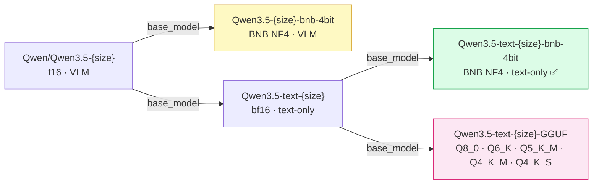
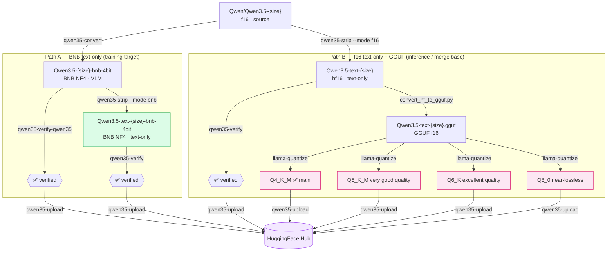

# qwen35-toolkit

Python toolkit for converting, stripping, verifying and publishing Qwen3.5 models
to HuggingFace Hub.

Part of a two-repo ecosystem:

| Repo | Purpose |
|------|---------|
| **qwen35-toolkit** (this repo) | Model prep — BNB quantization, visual tower strip, verify, upload |
| [qwen-qlora-train](https://github.com/techwithsergiu/qwen-qlora-train) | LoRA training, adapter inference, CPU merge |

---

## Published Models

All models are available on HuggingFace Hub in four collections:

| Collection                                                                                        | Description               | Models                |
|---------------------------------------------------------------------------------------------------|---------------------------|-----------------------|
| [Qwen3.5 BNB 4-bit](https://huggingface.co/collections/techwithsergiu/qwen35-bnb-4bit)            | VLM, BNB NF4 quantized    | 0.8B · 2B · 4B · 9B   |
| [Qwen3.5 Text](https://huggingface.co/collections/techwithsergiu/qwen35-text)                     | Text-only bf16            | 0.8B · 2B · 4B · 9B   |
| [Qwen3.5 Text BNB 4-bit](https://huggingface.co/collections/techwithsergiu/qwen35-text-bnb-4bit)  | Text-only, BNB NF4        | 0.8B · 2B · 4B · 9B   |
| [Qwen3.5 Text GGUF](https://huggingface.co/collections/techwithsergiu/qwen35-text-gguf)           | Text-only, GGUF Q4 - F16  | 0.8B · 2B · 4B · 9B   |

---

## Setup

### Prerequisites

- Arch Linux (or any Linux with NVIDIA driver)
- Python 3.11
- CUDA via driver (`nvidia-smi` works → CUDA is fine)

```bash
# I'm using Arch btw
yay -S python311
python3.11 -m venv venv
source venv/bin/activate
```

### Install

```bash
# 1. PyTorch with CUDA (toolkit does not use unsloth, so torch is installed explicitly)
pip install torch torchvision --index-url https://download.pytorch.org/whl/cu124

# 2a. Editable install (development / local clone)
pip install -e .

# 2b. Install directly from GitHub (no local clone needed)
pip install git+https://github.com/techwithsergiu/qwen35-toolkit.git
```

> For LoRA fine-tuning of prepared models, see
> [qwen-qlora-train](https://github.com/techwithsergiu/qwen-qlora-train).

### llama.cpp

```bash
git clone https://github.com/ggml-org/llama.cpp

# Build with CUDA support
cd llama.cpp
cmake -B build -DLLAMA_CUDA=ON
cmake --build build --config Release -j$(nproc)

# Running GGUF models with llama.cpp
# The GGUF models were quantized to Q4_K_M and are available at:
# https://huggingface.co/collections/techwithsergiu/qwen35-text-gguf
./build/bin/llama-cli \
  --hf-repo techwithsergiu/Qwen3.5-text-0.8B-GGUF \
  --hf-file Qwen3.5-text-0.8B-Q4_K_M.gguf \
  -p "Write a Python function that reverses a string." \
  -n 512

cd ..
```

### Node.js (for PDF export only)

```bash
npm install -g @mermaid-js/mermaid-cli
npx puppeteer browsers install chrome-headless-shell
```

---

## Commands

| CLI command              | Module                          | Purpose                                                               | Key args                                                                      |
|--------------------------|---------------------------------|-----------------------------------------------------------------------|-------------------------------------------------------------------------------|
| `qwen35-convert`         | `qwen35_toolkit.convert`        | f16 → BNB nf4 ⚠️ Qwen3.5 only                                        | `--model` `--output` `--low-vram` `--verbose` `--hf-token`                    |
| `qwen35-strip`           | `qwen35_toolkit.strip`          | Remove visual tower → text-only                                       | `--model` `--output` `--mode` `--hf-token`                                    |
| `qwen35-verify`          | `qwen35_toolkit.verify`         | Universal sanity-check — BNB 4-bit **and** f16/bf16, auto-detected   | `--model` `--hf-token`                                                        |
| `qwen35-verify-qwen35`   | `qwen35_toolkit.verify_qwen35`  | Qwen3.5 check — thinking ON/OFF + image                              | `--model` `--hf-token`                                                        |
| `qwen35-upload`          | `qwen35_toolkit.upload`         | Sync with HF Hub — push and pull                                      | `--local` `--repo` `--mode` `--files` `--message` `--hf-token` `--private`    |
| `qwen35-inspect`         | `qwen35_toolkit.tools.inspect_safetensors` | Print weight prefixes and sizes from safetensors headers  | positional: model path                                                        |
| `qwen35-render-mermaid`  | `qwen35_toolkit.tools.render_mermaid`      | Pre-render Mermaid diagrams → PNG for PDF export          | `--input` `--output` `--scale`                                                |
| —                        | —                               | GGUF f16 conversion (llama.cpp, external)                             | positional: model path, `--outtype`, `--outfile`                              |
| —                        | —                               | GGUF quantization (llama.cpp, external)                               | positional: input, output, type                                               |

All commands support `--help` for full usage.

---

## Hardware

|                                         |                              |
| --------------------------------------- | ---------------------------- |
| GPU                                     | RTX 3070 Laptop, 7.7 GB VRAM |
| BNB quantization (4B, default)          | ~5 GB VRAM                   |
| BNB quantization (any size, --low-vram) | ~400 MB VRAM peak            |
| f16 model load for strip/verify         | ~18 GB RAM                   |
| CPU merge                               | ~20 GB RAM (not VRAM)        |
| GGUF conversion (f16 → GGUF)            | ~18 GB RAM, no VRAM          |
| GGUF Q4_K_M inference (4B)              | ~5 GB VRAM                   |

---

## Model lineage

Four model families produced from the original Qwen3.5 f16.
Arrows show the `base_model` relationship declared in each HF repo.



> **Why GGUF `base_model` points to `Qwen3.5-text-{size}`:**
> The GGUF quants are derived from the text-only f16 model — same weights, different
> container format. Linking to the f16 text variant keeps the lineage clear and separates
> GGUF from the VLM branch on the Hub.

---

## Pipeline diagram



---

## HuggingFace README templates

Four template files — one per model family.
Replace `{SIZE}` with the model size (e.g. `0.8B`, `2B`, `4B`, `9B`).

| File                                            | Model type          | `pipeline_tag`       | `base_model`                         |
| ----------------------------------------------- | ------------------- | -------------------- | ------------------------------------ |
| `model_cards/README_Qwen3.5-bnb-4bit.md`        | BNB 4-bit VLM       | `image-text-to-text` | `Qwen/Qwen3.5-{SIZE}`                |
| `model_cards/README_Qwen3.5-text.md`            | f16 text-only       | `text-generation`    | `Qwen/Qwen3.5-{SIZE}`                |
| `model_cards/README_Qwen3.5-text-bnb-4bit.md`   | BNB 4-bit text-only | `text-generation`    | `techwithsergiu/Qwen3.5-text-{SIZE}` |
| `model_cards/README_Qwen3.5-text-GGUF.md`       | GGUF quants         | `text-generation`    | `techwithsergiu/Qwen3.5-text-{SIZE}` |

---

## Command reference

### qwen35-convert

⚠️ Qwen3.5-specific — uses `Qwen3_5ForConditionalGeneration`.

Conversion strategy (avoids the `Params4bit/_is_hf_initialized` version mismatch bug):

```text
1. Load full model into CPU RAM (bf16, no GPU involved)
2. Replace nn.Linear → Linear4bit in-place (still on CPU)
3. Quantize — BNB nf4 compression triggered by first .cuda() per weight.
   Two modes:
     default    : model.cuda() — full model to GPU at once.
     --low-vram : one layer at a time, each returned to CPU after quantization.
                  Peak VRAM ≈ one layer (~400 MB). Model saved from CPU.
4. Save quantized model + tokenizer
5. Rebuild config.json from source (architectures, vision_config, quantization_config)
   Patch tokenizer_config.json (chat_template)
6. Copy optional side-car files (merges.txt, vocab.json) — missing files silently skipped
```

Hardware requirements:
  RAM  : ~18 GB  (full bf16 model in RAM before quantization)
  VRAM : ~5 GB   (default) or ~400 MB (`--low-vram`)

Layers skipped from quantization (left at full precision):
`embed_tokens`, `embedding`, `lm_head`, `multi_modal_projector`,
`merger`, `modality_projection`, `router`, `visual`, `vision_tower`.

The `quantization_config` written to `config.json` uses exact model-tree paths
so transformers respects them on reload:

```json
"llm_int8_skip_modules": [
    "lm_head",
    "model.visual",
    "model.language_model.embed_tokens"
]
```

Short names (`"visual"` etc.) are used only during the in-process conversion
walk — they are not written to config.

`--verbose` prints every skip layer decision:

```text
⏳ Replacing linear layers with BNB Linear4bit …
   └── skipped      model.visual
   └── skipped      model.language_model.embed_tokens
   └── skipped      lm_head
   186 layers replaced
```

Useful to confirm visual layers are correctly skipped (not quantized).

---

### qwen35-strip

Removes the visual tower at the **file level** — no model load during stripping,
operates directly on safetensors shards.

Two modes:

| `--mode`        | Input          | Output              | Use for              |
| --------------- | -------------- | ------------------- | -------------------- |
| `bnb` (default) | BNB 4-bit VLM  | text-only BNB 4-bit | training target      |
| `f16`           | f16 / bf16 VLM | text-only bf16      | GGUF / merge base    |

```text
1. Strip visual weights   — drop model.visual.*, model.merger.*, etc. from
                            safetensors shards (header scan only, no model load)
                            Removes ~0.19 GB (0.8B) / ~0.62 GB (2B, 4B) / ~0.85 GB (9B)
2. Copy side-car files    — tokenizer.json, vocab.json, merges.txt, …
                            Vision-only sidecars (preprocessor_config.json etc.) omitted
3. Rebuild config.json    — starts from config["text_config"] as root to avoid
                            inheriting vision dimensions from the VLM config.
                            Sets architectures: ["Qwen3_5ForCausalLM"]
                            BNB mode: carries quantization_config, removes
                            model.visual from llm_int8_skip_modules
                            f16 mode:  drops quantization_config entirely
4. Patch chat template    — strips image/video branches from Jinja2 template
                            in both tokenizer_config.json and chat_template.jinja
5. Verify                 — structural check (config + safetensors key scan)
                            + inference check with automatic device selection
```

#### Device selection (automatic, no flags needed)

Both BNB and f16 modes pick the best available device automatically:

| `_pick_device()` result                 | Threshold           | Strategy                      |
| --------------------------------------- | ------------------- | ----------------------------- |
| `cuda_direct` — full model fits         | total ≤ 95% VRAM    | CPU load →`_move_to_cuda()`   |
| `cuda_drop` — backbone fits after strip | rest ≤ 95% VRAM     | CPU load →`_move_to_cuda()`   |
| `cpu` — too large or no CUDA            | rest > 95% VRAM     | stay on CPU                   |

`_move_to_cuda()` catches runtime OOM and falls back to CPU — inference
always runs regardless. CPU is a valid fallback for both BNB and f16.

#### HF Hub source

When `--model` is a HF repo id, `snapshot_download` uses the default HF cache
(`~/.cache/huggingface/hub`) — re-runs are instant.

---

### qwen35-verify / qwen35-verify-qwen35

Both scripts accept a **local path or a HF Hub repo id**.
Mode (BNB vs f16) and device strategy are **both auto-detected** — no flags needed.

Source is auto-detected: paths starting with `./`, `../`, `/`, `~` or pointing
to an existing directory are treated as local. Anything else containing a `/`
is treated as a HF repo id.

`verify_model.py` is the generic base; `verify_qwen35.py` imports it
and overrides only what's Qwen3.5-specific:

```bash
qwen35_toolkit/verify.py     ← generic, uses AutoModelForCausalLM
  │  is_hf_repo()                    detects local path vs HF repo id
  │  resolve_source()                returns (is_remote, label) for display
  │  check_config()                  fetches + validates config.json
  │  model_size_gb()                 actual on-disk size (all weights)
  │  detect_mode()                   reads config.json → "bnb" | "f16"
  │  detect_arch()                   reads config.json → "vlm" | "text"
  │  _pick_device()                  estimates total size vs VRAM → strategy
  │  _move_to_cuda()                 OOM-safe model.cuda() with CPU fallback
  │  restore_visual_to_fp()          restores visual layers to exact bf16
  │  drop_visual_tower()             removes visual submodule, frees RAM/VRAM
  │  count_quantized_layers()        counts Linear4bit vs total nn.Linear
  │  run_inference_tasks()           runs prompt list, reports tok/s
  │  verify()                        full pipeline: steps 1–5
  │
  └── qwen35_toolkit/verify_qwen35.py  ← Qwen3.5 specific, four modes (arch × mode)
        load_qwen35()                detects arch+mode, picks loader:
                                       vlm+bnb  → Qwen3_5ForConditionalGeneration
                                       vlm+f16  → Qwen3_5ForConditionalGeneration
                                       text+bnb → AutoModelForCausalLM
                                       text+f16 → AutoModelForCausalLM
        verify_qwen35()              4.  Image inference (VLM only)
                                     5a. Inference THINKING OFF
                                     5b. Inference THINKING ON
```

#### Verification steps

`verify_model.py` (generic):

```text
── 1. Config ─────── BNB: validates quantization_config, checks for expected keys
                     f16: reports architectures / model_type / torch_dtype
── 2. Load ───────── loads model + tokenizer; picks strategy, moves to device
                     _move_to_cuda() used as runtime OOM guard in all paths
── 3. Precision ──── BNB: counts Linear4bit layers, checks visual tower
                     f16: reports linear layer count + weight dtype
── 4. Inference [IMAGE] ── skipped (use verify_qwen35.py for VLM)
── 5. Inference ────────── model generates a coherent response 
                     for each test task
```

`verify_qwen35.py` (Qwen3.5 — all four arch × mode combinations):

```text
── 1. Config ─────── BNB: validates quantization_config, checks for expected keys
                     f16: reports architectures / model_type / torch_dtype
── 2. Load ───────── arch + mode auto-detected; loader chosen accordingly:
                       vlm+bnb  → Qwen3_5ForConditionalGeneration + restore_visual_to_fp
                       vlm+f16  → Qwen3_5ForConditionalGeneration + torch_dtype=auto
                       text+bnb → AutoModelForCausalLM
                       text+f16 → AutoModelForCausalLM + torch_dtype=auto
── 3. Precision ───── BNB: counts Linear4bit layers, checks visual tower
                     f16: reports linear layer count + weight dtype
── 4. Inference  [IMAGE] ────────── visual pipeline e2e test (see below)
                     device: GPU for cuda_direct, CPU for cuda_drop / cpu
                     vlm: visual pipeline e2e — device: GPU (cuda_direct) or CPU
                     text: skipped
── 5a. Inference  [THINKING OFF] ── math task, checks response correctness
── 5b. Inference  [THINKING ON]  ── same task with <think> block enabled
```

#### Automatic device strategy

`_pick_device()` reads actual on-disk file sizes (no model load) and picks a
loading strategy. Works identically for BNB and f16 — only the load path
differs (f16 loads directly to device; BNB always CPU-first).
Size accounting uses the full file size — this captures backbone, visual
tower, `lm_head`, `embed_tokens`, and all other non-quantized weights.
Summing only the quantized backbone would undercount (e.g. in 9B
`lm_head.weight` alone is ~1 GB of fp16).

| Threshold                     | Strategy      | Description                               |
| ----------------------------- | ------------- | ----------------------------------------- |
| total ≤ 95% VRAM              | cuda_direct   | full model fits → move everything to GPU  |
| (total - visual) ≤ 95% VRAM   | cuda_drop     | image test on CPU → drop visual → GPU     |
| (total - visual) > 95% VRAM   | cpu           | stay on CPU throughout                    |

```text
cuda_direct:
    Load to CPU (always CPU-first for BNB)
    _move_to_cuda()  — full model to GPU, visual included
    Image test on GPU  ✅ fast
    drop_visual_tower() → free VRAM
    Text inference on GPU

cuda_drop:
    Load to CPU
    Image test on CPU  (visual intact, all on same device)
    drop_visual_tower() → free RAM
    _move_to_cuda()  — backbone + lm_head + embeddings fit in VRAM
    Text inference on GPU

cpu:
    Load to CPU
    Image test on CPU
    drop_visual_tower() → free RAM
    Text inference on CPU  ← BNB does not require CUDA
```

**`_move_to_cuda()` — runtime OOM guard**: wraps every `model.cuda()` call.
If `OutOfMemoryError` is raised (e.g. due to fragmented VRAM, driver overhead,
or an imprecise file-size estimate), it clears the cache and falls back to CPU.
Inference always runs — no step is ever skipped due to VRAM constraints.

Note: `lm_head.weight` is intentionally left at full precision
(listed in `llm_int8_skip_modules` for stability / quality — quantizing
the output projection degrades generation noticeably).
It maps hidden states → vocabulary logits.
Visible in all model sizes; ~1 GB in 9B which is why the full-file-size
accounting matters there.

#### Visual tower handling

The converter writes `llm_int8_skip_modules: ["lm_head", "model.visual"]`
with exact model-tree paths into `config.json`. Transformers matches by prefix,
so `"model.visual"` covers the entire visual tower and prevents re-quantization
on load. This is the primary mechanism.

`restore_visual_to_fp()` acts as a **fallback** for models converted before
this fix or loaded from older Hub checkpoints. It reloads exact original bf16
weights directly from safetensors on disk (no dequantize rounding error).
Step 3 confirms whether restore was needed.

> **Note:** This assumes the remaining text backbone is architecturally
> compatible with the standalone text config of the same model size.
> Mixing visual weights from one size with text weights from another is
> unsupported and will produce garbage output without an obvious error.

#### Image inference test (step 4)

A 448×224 PNG with the left half red and right half blue is embedded as
base64 in the script (no file I/O, no network). The model is asked:
`"What color is the left half of this image? Answer with one word."`
Expected answer: `"red"` (case-insensitive).

This verifies the full visual pipeline end-to-end:
`image tokens → visual encoder → merger → language model → response`

To support a new model family: create `verify_<family>.py`, import helpers
from `verify_model`, override only the loader and model-specific generation kwargs.

---

### llama.cpp/convert_hf_to_gguf.py

Converts a HuggingFace text-only f16 model to GGUF format.
Part of the llama.cpp git submodule — requires the submodule to be initialised.
No build needed for this script (Python only).

Input must be a **text-only** model (`Qwen3_5ForCausalLM`) — the VLM variant will
fail or produce incorrect output because llama.cpp does not support the visual tower.

```bash
python llama.cpp/convert_hf_to_gguf.py <model_path> \
    --outtype f16 \
    --outfile <o>.gguf
```

---

### llama.cpp/build/bin/llama-quantize

Quantizes a GGUF f16 file to a smaller format. Requires llama.cpp to be built.

#### Quants

| File                              | Type   | Size vs f16 | Notes                                                  |
|-----------------------------------|--------|-------------|--------------------------------------------------------|
| `Qwen3.5-text-{SIZE}-Q8_0.gguf`   | Q8_0   | ~53% of f16 | near-lossless — for high-quality inference             |
| `Qwen3.5-text-{SIZE}-Q6_K.gguf`   | Q6_K   | ~41% of f16 | excellent quality, good balance with f16               |
| `Qwen3.5-text-{SIZE}-Q5_K_M.gguf` | Q5_K_M | ~37% of f16 | very good quality, smaller than Q6                     |
| `Qwen3.5-text-{SIZE}-Q4_K_M.gguf` | Q4_K_M | ~31% of f16 | ✅ recommended — best size/quality balance             |
| `Qwen3.5-text-{SIZE}-Q4_K_S.gguf` | Q4_K_S | ~30% of f16 | optional — slightly smaller, slightly lower quality    |

```bash
./llama.cpp/build/bin/llama-quantize <input.gguf> <output.gguf> <TYPE>
```

---

### qwen35-inspect

Reads safetensors shard headers (no weights loaded) and prints all weight prefixes
with their cumulative sizes. Runs instantly on any model size.

```bash
qwen35-inspect ./Qwen3.5-4B-bnb-4bit
```

```text
Found 5 shard(s)

PREFIX                                            SIZE
─────────────────────────────────────────────────────
model.language_model                          3.54 GB
model.visual                                  0.89 GB
lm_head                                      90.0 MB
model.visual.merger                          12.3 MB

TOTAL                                         4.54 GB
```

Useful for confirming which components are present before and after `qwen35-strip`.

---

### qwen35-render-mermaid

Pre-renders every ` ```mermaid ` block in a Markdown file to PNG using the Mermaid CLI
(`mmdc`), then outputs a new `.md` file with blocks replaced by `` image references.
Needed for PDF export from VS Code Office Viewer (which doesn't render Mermaid natively).

```bash
# One-time setup
npm install -g @mermaid-js/mermaid-cli
npx puppeteer browsers install chrome-headless-shell

# Render (replace <doc> with the target filename)
qwen35-render-mermaid --input <doc>.md
# → <doc>_pdf.md
# → diagrams/diagram_01.png, diagram_02.png  (mmdc_config.json auto-deleted)

# Higher scale for print quality (default: 2.0)
qwen35-render-mermaid --input <doc>.md --scale 3.0
```

---

### qwen35-upload

Six sync modes controlled by `--mode`:

| Mode              | Direction    | When to use                        | What happens                                                                                                  |
| ----------------- | ------------ | ---------------------------------- | ------------------------------------------------------------------------------------------------------------- |
| `init` (default)  | push         | First push of a new model          | Uploads full directory. Hub deduplicates by SHA256 — re-running is safe, unchanged shards not re-transferred  |
| `files`           | push         | Patching specific files            | Single atomic commit of the listed files only. Requires `--files`                                             |
| `diff`            | push         | Incremental push after local edits | Compares local SHA256 vs remote, uploads new/changed files, deletes remote-only files                         |
| `check`           | push dry-run | Inspect before pushing             | Same per-file table as `diff`, but nothing is uploaded or deleted                                             |
| `pull`            | pull         | Sync local from Hub                | Downloads new/changed files, removes local-only files. Large shards skipped if SHA256 already matches         |
| `fetch`           | pull dry-run | Inspect before pulling             | Same per-file table as `pull`, filesystem untouched                                                           |

For `.safetensors` / `.gguf` shards SHA256 is read directly from the LFS
pointer — no download needed for the push side.

Example `check` / `diff` output (push direction):

```text
   FILE                                           SIZE  STATUS
   ─────────────────────────────────────────────────────────────────────
   config.json                                   2.1 KB  📝 changed
   model-00001-of-00002.safetensors              4.9 GB  ✅ unchanged  (a3f1c2d4e5b6…)
   model-00002-of-00002.safetensors              3.1 GB  ✅ unchanged  (9b8e7f6a5c4d…)
   tokenizer_config.json                         1.8 KB  ✅ unchanged  (c2d4e5b6a7f8…)
   README.md                                       512 B  ✨ new
   preprocessor_config.json                          —  🗑️  remote-only → delete

   ── Summary ─────────────────────────────────────────────────────────
      to upload  : 2
      to delete  : 1
      unchanged  : 3
```

Example `fetch` / `pull` output (pull direction):

```text
   FILE                                           SIZE  STATUS
   ─────────────────────────────────────────────────────────────────────
   config.json                                   2.1 KB  📝 changed
   model-00001-of-00002.safetensors              4.9 GB  ✅ unchanged  (a3f1c2d4e5b6…)
   model-00002-of-00002.safetensors              3.1 GB  ✅ unchanged  (9b8e7f6a5c4d…)
   tokenizer_config.json                         1.8 KB  ✅ unchanged  (c2d4e5b6a7f8…)
   some_local_extra.json                              —  🗑️  local-only → remove

   ── Summary ─────────────────────────────────────────────────────────
      to download : 1
      to remove   : 1
      unchanged   : 3
```

---

## Usage examples

Steps 1–2 prepare models for training or inference.
Steps 3–4 are the post-training workflow — run these after
**[qlora-merge](https://github.com/techwithsergiu/qwen-qlora-train#cpu-merge)**
produces a merged fp16 model.

```bash
# ── Step 1a : BNB 4-bit quantization (keeps visual tower) ─────────────────────
qwen35-convert \
    --model  unsloth/Qwen3.5-0.8B \
    --output ./Qwen3.5-0.8B-bnb-4bit

# Low VRAM — quantizes one layer at a time (peak VRAM ~400 MB)
qwen35-convert \
    --model    unsloth/Qwen3.5-9B \
    --output   ./Qwen3.5-9B-bnb-4bit \
    --low-vram

# Verbose — print every layer replacement and skip decision
qwen35-convert \
    --model   unsloth/Qwen3.5-0.8B \
    --output  ./Qwen3.5-0.8B-bnb-4bit \
    --verbose

# ── Step 1b : strip visual tower ──────────────────────────────────────────────
# f16 VLM → text-only bf16
qwen35-strip \
    --model  unsloth/Qwen3.5-0.8B \
    --output ./Qwen3.5-text-0.8B \
    --mode   f16

# BNB 4-bit VLM → text-only BNB 4-bit (from already-converted local model)
qwen35-strip \
    --model  ./Qwen3.5-0.8B-bnb-4bit \
    --output ./Qwen3.5-text-0.8B-bnb-4bit \
    --mode   bnb

# From HF Hub with token
qwen35-strip \
    --model    unsloth/Qwen3.5-9B \
    --output   ./Qwen3.5-text-9B \
    --mode     f16 \
    --hf-token hf_...

# ── Inspect safetensors contents (optional, before/after strip) ───────────────
qwen35-inspect ./Qwen3.5-0.8B-bnb-4bit
qwen35-inspect ./Qwen3.5-text-0.8B-bnb-4bit

# ── Step 2 : verify ───────────────────────────────────────────────────────────
# Qwen3.5-specific: thinking ON/OFF + image inference test
qwen35-verify-qwen35 --model ./Qwen3.5-0.8B-bnb-4bit
qwen35-verify        --model ./Qwen3.5-text-0.8B-bnb-4bit

# From HF Hub (cached — re-runs skip download)
qwen35-verify-qwen35 --model techwithsergiu/Qwen3.5-0.8B-bnb-4bit
qwen35-verify        --model techwithsergiu/Qwen3.5-text-0.8B-bnb-4bit

# 9B model on 7.7 GB card — auto-detects cuda_drop: image test on CPU,
# drops visual tower, then backbone + lm_head moved to GPU
qwen35-verify-qwen35 --model ./Qwen3.5-9B-bnb-4bit

# ── Step 3 : GGUF conversion ─────────────────────────────────────────────────
# text-only f16 → GGUF f16 (requires llama.cpp — see Setup)
python llama.cpp/convert_hf_to_gguf.py ./Qwen3.5-text-0.8B \
    --outtype f16 \
    --outfile ./Qwen3.5-text-0.8B-GGUF/Qwen3.5-text-0.8B-F16.gguf

# Quantize — Q4_K_M main, Q4_K_S optional
# Q8_0 / Q6_K / Q5_K_M optional
./llama.cpp/build/bin/llama-quantize \
    ./Qwen3.5-text-0.8B-GGUF/Qwen3.5-text-0.8B-F16.gguf \
    ./Qwen3.5-text-0.8B-GGUF/Qwen3.5-text-0.8B-Q8_0.gguf \
    Q8_0

./llama.cpp/build/bin/llama-quantize \
    ./Qwen3.5-text-0.8B-GGUF/Qwen3.5-text-0.8B-F16.gguf \
    ./Qwen3.5-text-0.8B-GGUF/Qwen3.5-text-0.8B-Q6_K.gguf \
    Q6_K

./llama.cpp/build/bin/llama-quantize \
    ./Qwen3.5-text-0.8B-GGUF/Qwen3.5-text-0.8B-F16.gguf \
    ./Qwen3.5-text-0.8B-GGUF/Qwen3.5-text-0.8B-Q5_K_M.gguf \
    Q5_K_M

./llama.cpp/build/bin/llama-quantize \
    ./Qwen3.5-text-0.8B-GGUF/Qwen3.5-text-0.8B-F16.gguf \
    ./Qwen3.5-text-0.8B-GGUF/Qwen3.5-text-0.8B-Q4_K_M.gguf \
    Q4_K_M

./llama.cpp/build/bin/llama-quantize \
    ./Qwen3.5-text-0.8B-GGUF/Qwen3.5-text-0.8B-F16.gguf \
    ./Qwen3.5-text-0.8B-GGUF/Qwen3.5-text-0.8B-Q4_K_S.gguf \
    Q4_K_S

# ── PDF export (optional) ─────────────────────────────────────────────────────
qwen35-render-mermaid --input qwen35_conversion_pipeline.md
# → qwen35_conversion_pipeline_pdf.md + diagrams/

# ── Step 4 : upload to HF Hub ─────────────────────────────────────────────────
# BNB / f16 models — first push
qwen35-upload \
    --local ./Qwen3.5-0.8B-bnb-4bit \
    --repo  techwithsergiu/Qwen3.5-0.8B-bnb-4bit

# GGUF quants — first push (all quants in one repo)
qwen35-upload \
    --local ./Qwen3.5-text-0.8B-GGUF \
    --repo  techwithsergiu/Qwen3.5-text-0.8B-GGUF

# First push — private repo
qwen35-upload \
    --local    ./Qwen3.5-0.8B-bnb-4bit \
    --repo     techwithsergiu/Qwen3.5-0.8B-bnb-4bit \
    --private \
    --hf-token hf_...

# Patch specific files only (no re-upload of shards)
qwen35-upload \
    --local   ./Qwen3.5-0.8B-bnb-4bit \
    --repo    techwithsergiu/Qwen3.5-0.8B-bnb-4bit \
    --mode    files \
    --files   README.md tokenizer_config.json

# Push only new/changed files (+ delete remote-only files)
qwen35-upload \
    --local ./Qwen3.5-0.8B-bnb-4bit \
    --repo  techwithsergiu/Qwen3.5-0.8B-bnb-4bit \
    --mode  diff

# Dry-run push — inspect delta without uploading
qwen35-upload \
    --local ./Qwen3.5-0.8B-bnb-4bit \
    --repo  techwithsergiu/Qwen3.5-0.8B-bnb-4bit \
    --mode  check

# Pull new/changed files from Hub
qwen35-upload \
    --local ./Qwen3.5-0.8B-bnb-4bit \
    --repo  techwithsergiu/Qwen3.5-0.8B-bnb-4bit \
    --mode  pull

# Dry-run pull
qwen35-upload \
    --local ./Qwen3.5-0.8B-bnb-4bit \
    --repo  techwithsergiu/Qwen3.5-0.8B-bnb-4bit \
    --mode  fetch
```

---

## License

This project is licensed under the **Apache License 2.0**.

You are free to use, modify, and distribute this software in both open-source
and commercial applications, as long as you comply with the terms of the
Apache 2.0 License.

Full license text:  
[LICENSE](LICENSE)

---

## Third-party Licenses

This project relies on several third-party components, all using permissive
licenses compatible with Apache License 2.0

- **PyTorch** — BSD-3-Clause License (© PyTorch Contributors)  
  [github.com/pytorch/pytorch](https://github.com/pytorch/pytorch)
- **Transformers** — Apache License 2.0 (© Hugging Face)  
  [github.com/huggingface/transformers](https://github.com/huggingface/transformers)
- **huggingface_hub** — Apache License 2.0 (© Hugging Face)  
  [github.com/huggingface/huggingface_hub](https://github.com/huggingface/huggingface_hub)
- **Accelerate** — Apache License 2.0 (© Hugging Face)  
  [github.com/huggingface/accelerate](https://github.com/huggingface/accelerate)
- **safetensors** — Apache License 2.0 (© Hugging Face)  
  [github.com/huggingface/safetensors](https://github.com/huggingface/safetensors)
- **bitsandbytes** — MIT License (© Facebook, Inc. and its affiliates)  
  [github.com/bitsandbytes-foundation/bitsandbytes](https://github.com/bitsandbytes-foundation/bitsandbytes)
- **Pillow** — MIT-CMU License (© Jeffrey A. Clark)  
  [github.com/python-pillow/Pillow](https://github.com/python-pillow/Pillow)
- **NumPy** — BSD 3-Clause License (© NumPy Developers)  
  [github.com/numpy/numpy](https://github.com/numpy/numpy)
- **Mermaid CLI** — MIT License (© Tyler Long)  
  [github.com/mermaid-js/mermaid-cli](https://github.com/mermaid-js/mermaid-cli)
- **llama.cpp** — MIT License (© The ggml authors)  
  [github.com/ggml-org/llama.cpp](https://github.com/ggml-org/llama.cpp)

---
