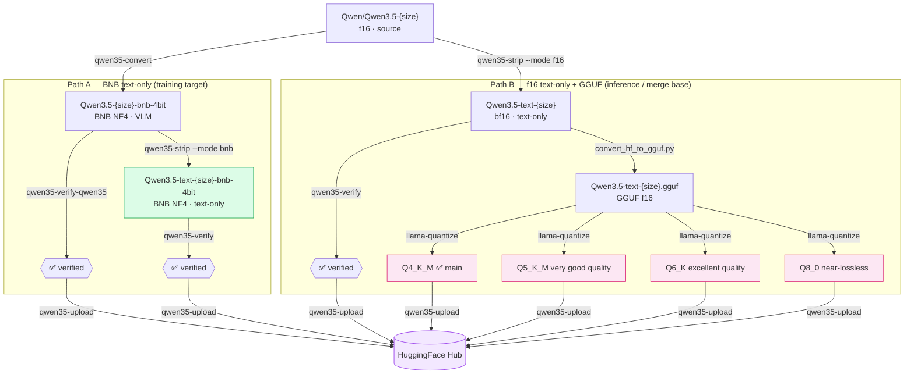

# Conversion pipeline

Two independent paths from the original Qwen3.5 f16 source.

**Path A** — BNB text-only (training target): quantize → strip → verify → upload.  
**Path B** — f16 text-only + GGUF (inference / merge base): strip → verify → convert → quantize → upload.

## Commands per step

| Step | Command | Doc |
|------|---------|-----|
| Quantize f16 → BNB 4-bit | `qwen35-convert` | [Convert](convert.md) |
| Strip visual tower (BNB) | `qwen35-strip --mode bnb` | [Strip](strip.md) |
| Strip visual tower (f16) | `qwen35-strip --mode f16` | [Strip](strip.md) |
| Verify VLM model | `qwen35-verify-qwen35` | [Verify](verify.md) |
| Verify text-only model | `qwen35-verify` | [Verify](verify.md) |
| Convert to GGUF | `convert_hf_to_gguf.py` (llama.cpp) | [GGUF](gguf.md) |
| Quantize GGUF | `llama-quantize` (llama.cpp) | [GGUF](gguf.md) |
| Upload to Hub | `qwen35-upload` | [Upload](upload.md) |
