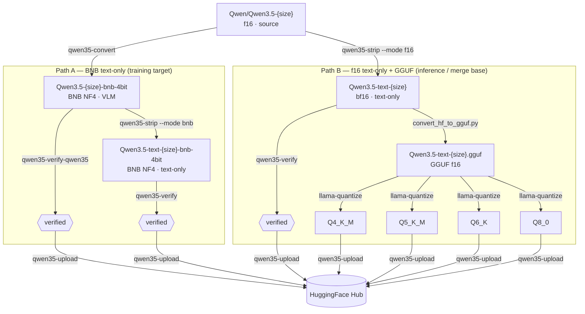

# Conversion pipeline

## What this page covers

This page maps the end-to-end conversion paths from original Qwen3.5 VLM checkpoints:
- Path A for BNB text-only training targets,
- Path B for f16 text-only + GGUF export targets.

## When to use

- You are deciding which artifact format to produce first.
- You need a high-level sequence before running command pages.
- You want to see where verification and upload happen in each path.

## Input -> Output

| Input | Output |
|------|--------|
| `unsloth/Qwen3.5-{size}` f16 source | BNB text-only model for training (Path A) |
| `unsloth/Qwen3.5-{size}` f16 source | bf16/f16 text-only + GGUF quants for inference/export (Path B) |

## Diagram



## Steps

1. Choose path by target artifact:
   - Path A for BNB text-only training input.
   - Path B for GGUF export/inference flow.
2. Run strip/verify checkpoints in sequence.
3. Upload validated artifacts to Hub.

## Path selection guide

Use Path A when:
- target is QLoRA training input,
- you need text-only BNB (`Qwen3.5-text-*-bnb-4bit`).

Use Path B when:
- target is standalone inference/export artifacts,
- you need GGUF quants (`Q4_K_M`, `Q5_K_M`, `Q6_K`, `Q8_0`),
- you need a merge/export base in text-only f16/bf16.

## Phase gates

```text
Gate 1 — Artifact gate (after convert/strip):
  - Expected directory exists.
  - Expected format matches target path (bnb text-only or f16/bf16 text-only).

Gate 2 — Verification gate:
  - Structural checks pass.
  - Inference checks pass.

Gate 3 — Quantization gate (Path B):
  - GGUF f16 exists.
  - Target quant files exist (`Q4_K_M`, optional others).

Gate 4 — Publish gate:
  - Dry-run sync (`check`/`fetch`) shows expected delta.
  - No unexpected delete/remove actions.
```

Why it matters: this prevents publishing partially converted or unverified artifacts.

## Command map

| Step | Command | Docs |
|------|---------|------|
| Quantize f16 -> BNB 4-bit | `qwen35-convert` | [Convert](convert.md) |
| Strip visual tower (BNB/f16) | `qwen35-strip` | [Strip](strip.md) |
| Verify VLM model | `qwen35-verify-qwen35` | [Verify](verify.md) |
| Verify text-only model | `qwen35-verify` | [Verify](verify.md) |
| Convert to GGUF | `convert_hf_to_gguf.py` | [GGUF](gguf.md) |
| Quantize GGUF | `llama-quantize` | [GGUF](gguf.md) |
| Upload to Hub | `qwen35-upload` | [Upload](upload.md) |

## Related

- [Quickstart](quickstart.md)
- [Hardware](hardware.md)
- [Verify](verify.md)
