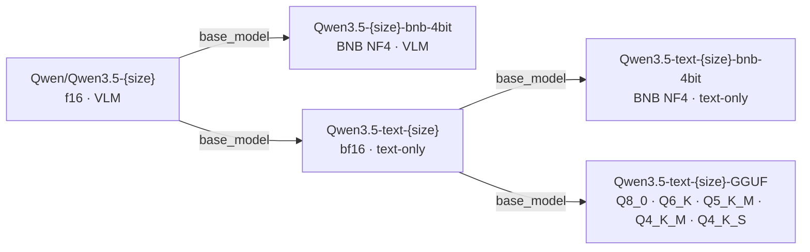

# Published models

## What this page covers

This page lists published model families, their lineage, and model-card template mapping.
Use it as an index before downloading, publishing, or extending model cards.

## When to use

- You need the right Hugging Face collection link.
- You want to understand how each model family is derived.
- You need the correct README template for a given model type.

## Collections on Hugging Face Hub

| Collection | Description | Sizes |
|---|---|---|
| [Qwen3.5 BNB 4-bit](https://huggingface.co/collections/techwithsergiu/qwen35-bnb-4bit) | VLM, BNB NF4 quantized | 0.8B · 2B · 4B · 9B |
| [Qwen3.5 Text](https://huggingface.co/collections/techwithsergiu/qwen35-text) | Text-only bf16 | 0.8B · 2B · 4B · 9B |
| [Qwen3.5 Text BNB 4-bit](https://huggingface.co/collections/techwithsergiu/qwen35-text-bnb-4bit) | Text-only BNB NF4 | 0.8B · 2B · 4B · 9B |
| [Qwen3.5 Text GGUF](https://huggingface.co/collections/techwithsergiu/qwen35-text-gguf) | Text-only GGUF (Q8 to Q4) | 0.8B · 2B · 4B · 9B |

## Model lineage

Lineage note:
- GGUF `base_model` points to text-only f16 model, because GGUF is a container/quant format change of the text branch.

## README templates

| File | Model type | `pipeline_tag` | `base_model` |
|---|---|---|---|
| `model_cards/README_Qwen3.5-bnb-4bit.md` | BNB 4-bit VLM | `image-text-to-text` | `Qwen/Qwen3.5-{SIZE}` |
| `model_cards/README_Qwen3.5-text.md` | f16 text-only | `text-generation` | `Qwen/Qwen3.5-{SIZE}` |
| `model_cards/README_Qwen3.5-text-bnb-4bit.md` | BNB 4-bit text-only | `text-generation` | `techwithsergiu/Qwen3.5-text-{SIZE}` |
| `model_cards/README_Qwen3.5-text-GGUF.md` | GGUF quants | `text-generation` | `techwithsergiu/Qwen3.5-text-{SIZE}` |

## Related

- [Quickstart](quickstart.md)
- [Conversion pipeline](conversion-pipeline.md)
- [Tools](tools.md)
