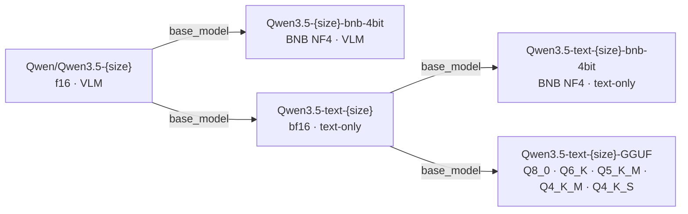
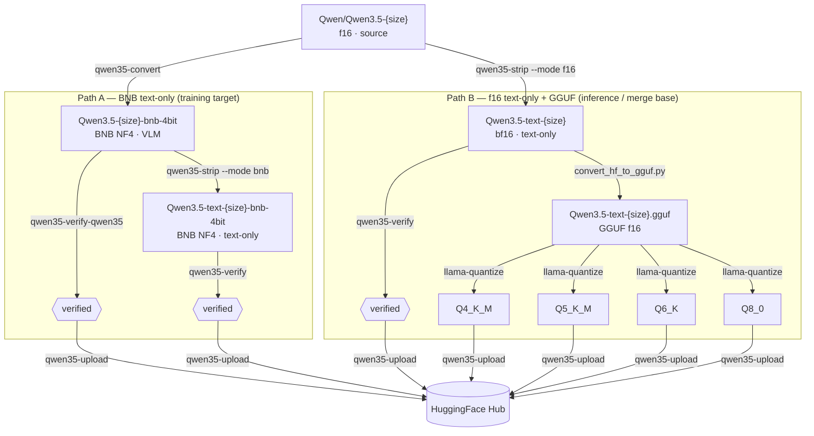

---
tags:
- techwithsergiu
library_name: transformers
license: apache-2.0
license_link: https://huggingface.co/Qwen/Qwen3.5-{SIZE}/blob/main/LICENSE
pipeline_tag: image-text-to-text
base_model:
- Qwen/Qwen3.5-{SIZE}
---

# Qwen3.5-{SIZE}-bnb-4bit


BNB NF4 4-bit quantization of [Qwen/Qwen3.5-{SIZE}](https://huggingface.co/Qwen/Qwen3.5-{SIZE}).

Retains the full visual tower — this is a **VLM-capable** model (image + text input).
Primary use-case: Unsloth LoRA fine-tuning when you need image understanding in the
fine-tuned result.

> If you only need text fine-tuning, use
> [techwithsergiu/Qwen3.5-text-{SIZE}-bnb-4bit](https://huggingface.co/techwithsergiu/Qwen3.5-text-{SIZE}-bnb-4bit)
> instead — same backbone, visual tower removed, lighter VRAM footprint.

## What was changed

- Quantized with `bitsandbytes` NF4 double-quant (`bnb_4bit_quant_type=nf4`, `bnb_4bit_compute_dtype=bfloat16`)
- Visual tower layers kept at **bf16** (`llm_int8_skip_modules`) — required for correct image inference
- `lm_head.weight` kept at **bf16** for output quality

## Model family



| Model | Type | Base model |
|---|---|---|
| [Qwen/Qwen3.5-{SIZE}](https://huggingface.co/Qwen/Qwen3.5-{SIZE}) | f16 · VLM · source | — |
| **[techwithsergiu/Qwen3.5-{SIZE}-bnb-4bit](https://huggingface.co/techwithsergiu/Qwen3.5-{SIZE}-bnb-4bit)** | BNB NF4 · VLM | Qwen/Qwen3.5-{SIZE} |
| [techwithsergiu/Qwen3.5-text-{SIZE}](https://huggingface.co/techwithsergiu/Qwen3.5-text-{SIZE}) | bf16 · text-only | Qwen/Qwen3.5-{SIZE} |
| [techwithsergiu/Qwen3.5-text-{SIZE}-bnb-4bit](https://huggingface.co/techwithsergiu/Qwen3.5-text-{SIZE}-bnb-4bit) | BNB NF4 · text-only | Qwen3.5-text-{SIZE} |
| [techwithsergiu/Qwen3.5-text-{SIZE}-GGUF](https://huggingface.co/techwithsergiu/Qwen3.5-text-{SIZE}-GGUF) | GGUF quants | Qwen3.5-text-{SIZE} |

The visual tower is a bf16 overhead that scales with model size (~0.19 GB for 0.8B, ~0.62 GB for 2B/4B, ~0.85 GB for 9B).
BNB-quantized models are roughly 40% of the original f16 size (exact ratio varies by size).

## Fine-tuning

**Text-only LoRA fine-tuning** — use the text-only BNB variant as training base:
[techwithsergiu/Qwen3.5-text-{SIZE}-bnb-4bit](https://huggingface.co/techwithsergiu/Qwen3.5-text-{SIZE}-bnb-4bit)

Training pipeline (QLoRA · Unsloth · TRL):
[github.com/techwithsergiu/qwen-qlora-train](https://techwithsergiu.github.io/qwen-qlora-train)

**VLM (image + text) fine-tuning** — refer to the official Unsloth guide:
[unsloth.ai/docs/models/qwen3.5/fine-tune](https://unsloth.ai/docs/models/qwen3.5/fine-tune)

## Pipeline diagram



## Conversion

Converted using [qwen35-toolkit](https://techwithsergiu.github.io/qwen35-toolkit) —
a Python toolkit for BNB quantization, visual tower removal, verification and
HF Hub publishing of Qwen3.5 models.

---

## Acknowledgements

Based on [Qwen/Qwen3.5-{SIZE}](https://huggingface.co/Qwen/Qwen3.5-{SIZE})
by the Qwen Team. If you use this model in research, please cite the original:

```bibtex
@misc{qwen3.5,
    title  = {{Qwen3.5}: Towards Native Multimodal Agents},
    author = {{Qwen Team}},
    month  = {February},
    year   = {2026},
    url    = {https://qwen.ai/blog?id=qwen3.5}
}
```
