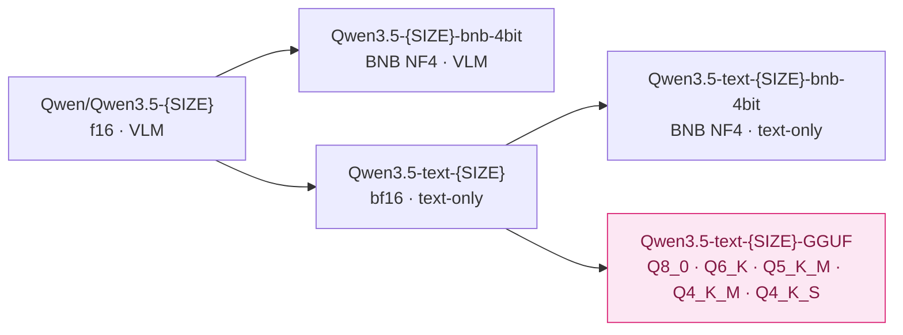
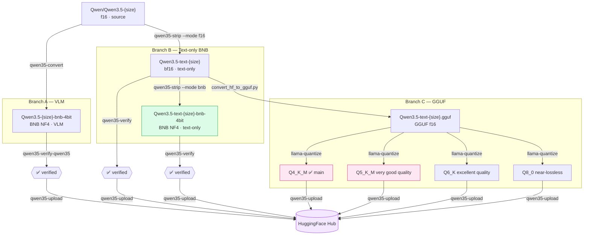

---
tags:
- techwithsergiu
- gguf
- qwen3_5_text
library_name: gguf
license: apache-2.0
license_link: https://huggingface.co/Qwen/Qwen3.5-{SIZE}/blob/main/LICENSE
pipeline_tag: text-generation
base_model:
- techwithsergiu/Qwen3.5-text-{SIZE}
---

# Qwen3.5-text-{SIZE}-GGUF


GGUF quants of [techwithsergiu/Qwen3.5-text-{SIZE}](https://huggingface.co/techwithsergiu/Qwen3.5-text-{SIZE}) —
the text-only bf16 derivative of [Qwen/Qwen3.5-{SIZE}](https://huggingface.co/Qwen/Qwen3.5-{SIZE}).

The visual tower has been removed before conversion. All text-backbone weights are
**identical** to the original — no retraining, no weight changes, no quality loss for
text tasks.

## Quants

| File | Type | Size | Notes |
|---|---|---|---|
| `Qwen3.5-text-{SIZE}-Q8_0.gguf` | Q8_0 | ~53% of f16 | near-lossless — for high-quality inference |
| `Qwen3.5-text-{SIZE}-Q6_K.gguf` | Q6_K | ~41% of f16 | excellent quality, good balance with f16 |
| `Qwen3.5-text-{SIZE}-Q5_K_M.gguf` | Q5_K_M | ~37% of f16 | very good quality, smaller than Q6 |
| `Qwen3.5-text-{SIZE}-Q4_K_M.gguf` | Q4_K_M | ~31% of f16 | ✅ recommended — best size/quality balance |
| `Qwen3.5-text-{SIZE}-Q4_K_S.gguf` | Q4_K_S | ~30% of f16 | optional — slightly smaller, slightly lower quality |

## Model family



| Model | Type | Base model |
|---|---|---|
| [Qwen/Qwen3.5-{SIZE}](https://huggingface.co/Qwen/Qwen3.5-{SIZE}) | f16 · VLM · source | — |
| [techwithsergiu/Qwen3.5-{SIZE}-bnb-4bit](https://huggingface.co/techwithsergiu/Qwen3.5-{SIZE}-bnb-4bit) | BNB NF4 · VLM | Qwen/Qwen3.5-{SIZE} |
| [techwithsergiu/Qwen3.5-text-{SIZE}](https://huggingface.co/techwithsergiu/Qwen3.5-text-{SIZE}) | bf16 · text-only | Qwen/Qwen3.5-{SIZE} |
| [techwithsergiu/Qwen3.5-text-{SIZE}-bnb-4bit](https://huggingface.co/techwithsergiu/Qwen3.5-text-{SIZE}-bnb-4bit) | BNB NF4 · text-only | Qwen3.5-text-{SIZE} |
| **[techwithsergiu/Qwen3.5-text-{SIZE}-GGUF](https://huggingface.co/techwithsergiu/Qwen3.5-text-{SIZE}-GGUF)** | GGUF quants | Qwen3.5-text-{SIZE} |

The GGUF repo is derived from the text-only f16 model — same weights, different container
format. `base_model` points to the f16 text variant to keep the VLM and text lineages
distinct on the Hub.

## Inference

### llama.cpp

```bash
./llama.cpp/build/bin/llama-cli \
    -m Qwen3.5-text-{SIZE}-Q4_K_M.gguf \
    -p "What is the capital of Romania?" \
    -n 256
```

### LM Studio

Load any `.gguf` file from this repo directly in [LM Studio](https://lmstudio.ai).
Recommended quant: `Q4_K_M`.

### Thinking mode

Qwen3.5 supports an optional chain-of-thought `<think>` block before the answer.
Thinking is **enabled by default** in llama.cpp.

**Note:** `--chat-template-kwargs '{"enable_thinking":...}'` is deprecated — do not use.
**Known issue:** `--reasoning off` is accepted but does not actually disable thinking.
**Workaround:** use `--reasoning-budget 0` — this reliably disables the `<think>` block.
Track the bug at [llama.cpp issues](https://github.com/ggml-org/llama.cpp/issues).

```bash
# Thinking OFF — direct answer (workaround: --reasoning-budget 0)
./llama.cpp/build/bin/llama-cli \
    -m Qwen3.5-text-{SIZE}-Q4_K_M.gguf \
    --reasoning-budget 0 \
    -p "What is the capital of Romania?" \
    -n 256

# Thinking ON — default, no flag needed
./llama.cpp/build/bin/llama-cli \
    -m Qwen3.5-text-{SIZE}-Q4_K_M.gguf \
    -p "What is 17 × 34?" \
    -n 1024
```

## Pipeline diagram



## Conversion

Converted using [qwen35-toolkit](https://github.com/techwithsergiu/qwen35-toolkit) —
a Python toolkit for BNB quantization, visual tower removal, verification and
HF Hub publishing of Qwen3.5 models.

---

## Acknowledgements

Based on [Qwen/Qwen3.5-{SIZE}](https://huggingface.co/Qwen/Qwen3.5-{SIZE})
by the Qwen Team. If you use this model in research, please cite the original:

```bibtex
@misc{qwen3.5,
    title  = {{Qwen3.5}: Towards Native Multimodal Agents},
    author = {{Qwen Team}},
    month  = {February},
    year   = {2026},
    url    = {https://qwen.ai/blog?id=qwen3.5}
}
```
