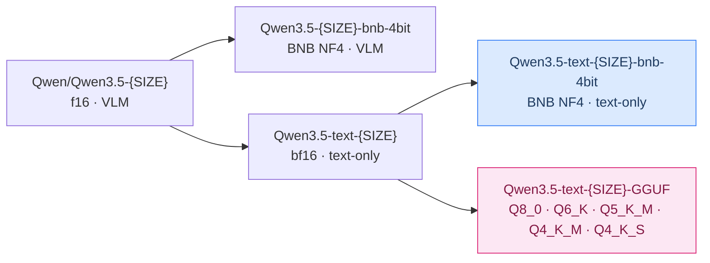
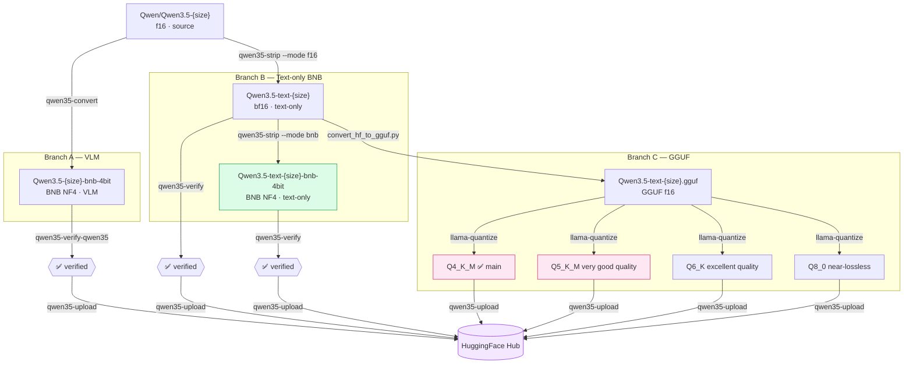

---
tags:
- techwithsergiu
library_name: transformers
license: apache-2.0
license_link: https://huggingface.co/Qwen/Qwen3.5-{SIZE}/blob/main/LICENSE
pipeline_tag: text-generation
base_model:
- techwithsergiu/Qwen3.5-text-{SIZE}
---

# Qwen3.5-text-{SIZE}-bnb-4bit


BNB NF4 4-bit quantization of [techwithsergiu/Qwen3.5-text-{SIZE}](https://huggingface.co/techwithsergiu/Qwen3.5-text-{SIZE}) —
a text-only derivative of [Qwen/Qwen3.5-{SIZE}](https://huggingface.co/Qwen/Qwen3.5-{SIZE}).

**No visual tower** — text input only. This is the recommended base for Unsloth LoRA
text fine-tuning: smaller VRAM footprint, no visual-dependency complexity, cleaner
adapter targeting.

Inference has been verified. LoRA fine-tuning docs are pending — see Fine-tuning section below.

## What was changed from the original Qwen3.5-{SIZE}

- Visual tower removed (same as `Qwen3.5-text-{SIZE}`)
- Text backbone quantized to BNB NF4 double-quant (`bnb_4bit_quant_type=nf4`, `bnb_4bit_compute_dtype=bfloat16`)
- `lm_head.weight` kept at **bf16** for output quality / stability

## Model family



| Model | Type | Base model |
|---|---|---|
| [Qwen/Qwen3.5-{SIZE}](https://huggingface.co/Qwen/Qwen3.5-{SIZE}) | f16 · VLM · source | — |
| [techwithsergiu/Qwen3.5-{SIZE}-bnb-4bit](https://huggingface.co/techwithsergiu/Qwen3.5-{SIZE}-bnb-4bit) | BNB NF4 · VLM | Qwen/Qwen3.5-{SIZE} |
| [techwithsergiu/Qwen3.5-text-{SIZE}](https://huggingface.co/techwithsergiu/Qwen3.5-text-{SIZE}) | bf16 · text-only | Qwen/Qwen3.5-{SIZE} |
| **[techwithsergiu/Qwen3.5-text-{SIZE}-bnb-4bit](https://huggingface.co/techwithsergiu/Qwen3.5-text-{SIZE}-bnb-4bit)** | BNB NF4 · text-only | Qwen3.5-text-{SIZE} |
| [techwithsergiu/Qwen3.5-text-{SIZE}-GGUF](https://huggingface.co/techwithsergiu/Qwen3.5-text-{SIZE}-GGUF) | GGUF quants | Qwen3.5-text-{SIZE} |

The visual tower scales with model size (~0.19 GB for 0.8B, ~0.62 GB for 2B/4B, ~0.85 GB for 9B).
BNB text-only models are roughly 34% of the original f16 size (4B example: 9.32 GB → 3.12 GB).

## Inference

```python
from transformers import AutoModelForCausalLM, AutoTokenizer

model_name = "techwithsergiu/Qwen3.5-text-{SIZE}-bnb-4bit"

tokenizer = AutoTokenizer.from_pretrained(model_name)
model = AutoModelForCausalLM.from_pretrained(
    model_name,
    device_map="auto",
    trust_remote_code=True,
)

messages = [{"role": "user", "content": "What is the capital of Romania?"}]

# Thinking OFF — direct answer
text = tokenizer.apply_chat_template(
    messages,
    tokenize=False,
    add_generation_prompt=True,
    enable_thinking=False,
)
inputs = tokenizer(text, return_tensors="pt").to(model.device)
outputs = model.generate(**inputs, max_new_tokens=256)
response = tokenizer.decode(
    outputs[0][inputs["input_ids"].shape[1]:],
    skip_special_tokens=True,
)
print(response)

# Thinking ON — chain-of-thought before the answer
text = tokenizer.apply_chat_template(
    messages,
    tokenize=False,
    add_generation_prompt=True,
    enable_thinking=True,
)
inputs = tokenizer(text, return_tensors="pt").to(model.device)
outputs = model.generate(**inputs, max_new_tokens=1024)
response = tokenizer.decode(
    outputs[0][inputs["input_ids"].shape[1]:],
    skip_special_tokens=True,
)
print(response)
```

## Fine-tuning

> **TBD** — LoRA training with this model has not been documented yet.
> The model has been verified for inference (text generation, thinking ON/OFF).
> The expectation is that standard Unsloth LoRA training applies — this is a
> text-only BNB 4-bit model architecturally identical to models Unsloth supports —
> but this has not been tested yet and there is no official Qwen3.5 text-only
> training guide to reference.
>
> For VLM (image + text) fine-tuning of the full model, see:
> [unsloth.ai/docs/models/qwen3.5/fine-tune](https://unsloth.ai/docs/models/qwen3.5/fine-tune)

## Pipeline diagram



## Conversion

Converted using [qwen35-toolkit](https://github.com/techwithsergiu/qwen35-toolkit) —
a Python toolkit for BNB quantization, visual tower removal, verification and
HF Hub publishing of Qwen3.5 models.

---

## Acknowledgements

Based on [Qwen/Qwen3.5-{SIZE}](https://huggingface.co/Qwen/Qwen3.5-{SIZE})
by the Qwen Team. If you use this model in research, please cite the original:

```bibtex
@misc{qwen3.5,
    title  = {{Qwen3.5}: Towards Native Multimodal Agents},
    author = {{Qwen Team}},
    month  = {February},
    year   = {2026},
    url    = {https://qwen.ai/blog?id=qwen3.5}
}
```
