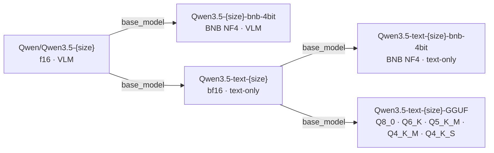
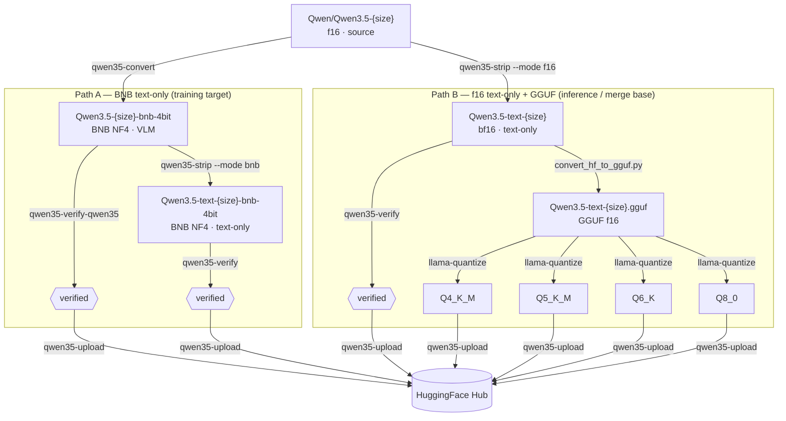

---
tags:
- techwithsergiu
library_name: transformers
license: apache-2.0
license_link: https://huggingface.co/Qwen/Qwen3.5-{SIZE}/blob/main/LICENSE
pipeline_tag: text-generation
base_model:
- Qwen/Qwen3.5-{SIZE}
---

# Qwen3.5-text-{SIZE}


Text-only bf16 derivative of [Qwen/Qwen3.5-{SIZE}](https://huggingface.co/Qwen/Qwen3.5-{SIZE}).

The visual tower (vision encoder, image merger, video preprocessor) has been removed.
All text-backbone weights are **identical** to the original — no retraining, no weight
changes, no quality loss for text tasks.

Primary use-case: intermediate model for GGUF conversion or CPU-side f16 merge after
LoRA training. For direct fine-tuning use
[techwithsergiu/Qwen3.5-text-{SIZE}-bnb-4bit](https://huggingface.co/techwithsergiu/Qwen3.5-text-{SIZE}-bnb-4bit).

## What was changed

- Visual tower removed: `visual`, `image_newline`, `patch_embed`, and related keys
  stripped from safetensors shards
- `config.json` updated: `architectures` → `Qwen3_5ForCausalLM`, `vision_config` removed
- `tokenizer_config.json` and `chat_template.jinja`: image/video branches stripped from
  the Jinja2 chat template — prevents tokenizer errors when no image is provided
- Vision-specific sidecar files omitted (`preprocessor_config.json`, `processor_config.json`,
  `video_preprocessor_config.json`)
- All text weights remain at **bf16**

## Model family



| Model | Type | Base model |
|---|---|---|
| [Qwen/Qwen3.5-{SIZE}](https://huggingface.co/Qwen/Qwen3.5-{SIZE}) | f16 · VLM · source | — |
| [techwithsergiu/Qwen3.5-{SIZE}-bnb-4bit](https://huggingface.co/techwithsergiu/Qwen3.5-{SIZE}-bnb-4bit) | BNB NF4 · VLM | Qwen/Qwen3.5-{SIZE} |
| **[techwithsergiu/Qwen3.5-text-{SIZE}](https://huggingface.co/techwithsergiu/Qwen3.5-text-{SIZE})** | bf16 · text-only | Qwen/Qwen3.5-{SIZE} |
| [techwithsergiu/Qwen3.5-text-{SIZE}-bnb-4bit](https://huggingface.co/techwithsergiu/Qwen3.5-text-{SIZE}-bnb-4bit) | BNB NF4 · text-only | Qwen3.5-text-{SIZE} |
| [techwithsergiu/Qwen3.5-text-{SIZE}-GGUF](https://huggingface.co/techwithsergiu/Qwen3.5-text-{SIZE}-GGUF) | GGUF quants | Qwen3.5-text-{SIZE} |

Removing the visual tower saves ~0.19 GB (0.8B), ~0.62 GB (2B / 4B), or ~0.85 GB (9B).
The relative saving is larger for smaller models.

## Inference

```python
from transformers import AutoModelForCausalLM, AutoTokenizer
import torch

model_name = "techwithsergiu/Qwen3.5-text-{SIZE}"

tokenizer = AutoTokenizer.from_pretrained(model_name)
model = AutoModelForCausalLM.from_pretrained(
    model_name,
    dtype=torch.bfloat16,
    device_map="auto",
)

messages = [{"role": "user", "content": "What is the capital of Romania?"}]

# Thinking OFF — direct answer
text = tokenizer.apply_chat_template(
    messages,
    tokenize=False,
    add_generation_prompt=True,
    enable_thinking=False,
)
inputs = tokenizer(text, return_tensors="pt").to(model.device)
outputs = model.generate(**inputs, max_new_tokens=256)
response = tokenizer.decode(
    outputs[0][inputs["input_ids"].shape[1]:],
    skip_special_tokens=True,
)
print(response)

# Thinking ON — chain-of-thought before the answer
text = tokenizer.apply_chat_template(
    messages,
    tokenize=False,
    add_generation_prompt=True,
    enable_thinking=True,
)
inputs = tokenizer(text, return_tensors="pt").to(model.device)
outputs = model.generate(**inputs, max_new_tokens=1024)
response = tokenizer.decode(
    outputs[0][inputs["input_ids"].shape[1]:],
    skip_special_tokens=True,
)
print(response)
```

## Fine-tuning

This model is an **intermediate artifact** — not a direct training target.
For fine-tuning, use [techwithsergiu/Qwen3.5-text-{SIZE}-bnb-4bit](https://huggingface.co/techwithsergiu/Qwen3.5-text-{SIZE}-bnb-4bit)
which is the BNB-quantized version of this model.

Training pipeline (QLoRA · Unsloth · TRL):
[github.com/techwithsergiu/qwen-qlora-train](https://techwithsergiu.github.io/qwen-qlora-train)

## Pipeline diagram



## Conversion

Converted using [qwen35-toolkit](https://techwithsergiu.github.io/qwen35-toolkit) —
a Python toolkit for BNB quantization, visual tower removal, verification and
HF Hub publishing of Qwen3.5 models.

---

## Acknowledgements

Based on [Qwen/Qwen3.5-{SIZE}](https://huggingface.co/Qwen/Qwen3.5-{SIZE})
by the Qwen Team. If you use this model in research, please cite the original:

```bibtex
@misc{qwen3.5,
    title  = {{Qwen3.5}: Towards Native Multimodal Agents},
    author = {{Qwen Team}},
    month  = {February},
    year   = {2026},
    url    = {https://qwen.ai/blog?id=qwen3.5}
}
```
